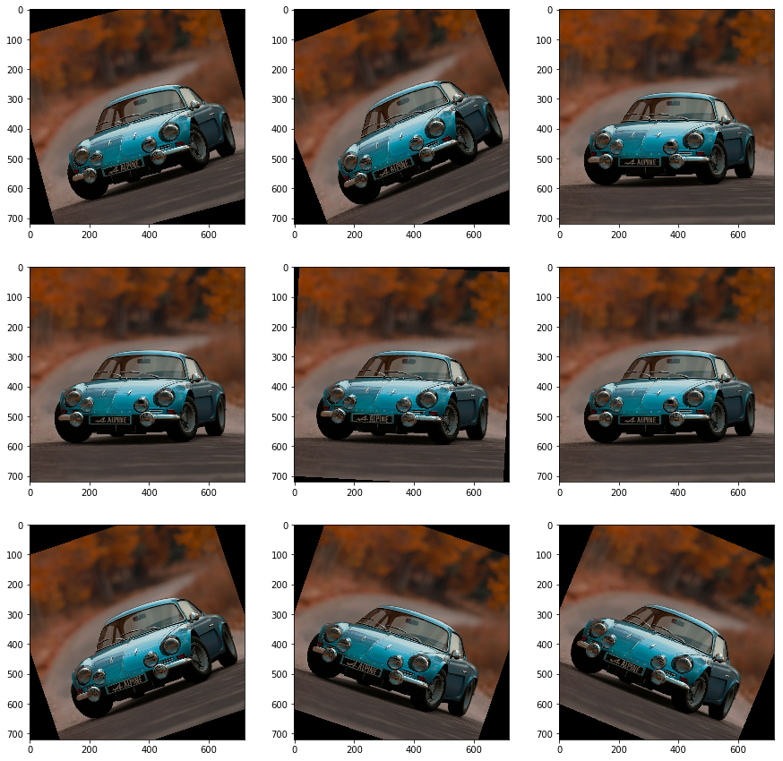

# Overdrive

A lightweight library for data augmentation compatible with the Tensorflow Dataset API. 

*The name "Overdrive" comes from the guitare sound effect with the same name. In guitar, or music in general, the overdrive sound effect is a slight distortion. In data augmentation for computer vision we want to distort the images but just slightly, hence overdrive*

# Requirements

* Tensorflow (tested on `2.0.0a` so far)
* Numpy
* Tensorflow-addons
* Python 3 only

# Works with Tensorflow Dataset API

**Overdrive** transformations (or overdrivers) operate over Tensorflow tensors, therefore, they can be easily used with `tf.data.Dataset.map` function. More precisely, overdrivers operate over batches of images.

# Available Transformations

## Rotations

### NinetyRotator

Randomly rotates a batch of images $90k^{\circ}$. Note that this can only be used with batches of square images (height = width).


```python
rotator90 = od.NinetyRotator(probability=.75, labeled=False)
rotated_dataset = dataset.map(rotator90)
```


### FreeRotator

*Uses Tensorflow-addons*

Randomly rotates images by an angle within a range $(-d, +d)$.


```python
freerotator = od.FreeRotator(probability=.75, labeled=False, degree=30)
rotated_dataset = dataset.map(freerotator)
```




## Color-based Augmentations

### ChannelDisturber

Multiplies RGB pixels for each image by a random vector in $(1-f, 1+f)^3$ creating a different color/white balance.


```python
channeldist = od.ChannelDisturber(probability=.8, labeled=False, factor=.25)
color_dataset = dataset.map(channeldist)
```


### RandomSaturator

Multiplies the image saturation by a random factor in $(minfactor, maxfactor)$.


```python
saturator = od.RandomSaturator(probability=.8, labeled=False, minfactor=.0, maxfactor=2.)
color_dataset = dataset.map(saturator)
```


## Cropping

### RelativeCropper

Crops a random patch of the image with a random area in $(minarea, 1.)$ relative to the size of the image, then resizes the images to a target size.

```python
cropper = od.RelativeCropper(probability=.75, labeled=False, minarea=.66, target_size=(720, 720))
cropped_dataset = dataset.map(cropper)
```


### AbsoluteCropper

Randomly crops fixed-size patches from in the input image given a specific size. It doesn't allow probability because otherwise there will be differences in size across batches.


```python
cropper = od.AbsoluteCropper(labeled=False, target_size=(512, 512))
cropped_dataset = dataset.map(cropper)
```


## Perspective transform

### Tilter

*Uses Tensorflow-addons*

Tilts the images randomly forward or backward.


```python
tilter = od.Tilter(probability=.75, labeled=False, maxdelta=.25, size=720, batch_size=1)
tilted_dataset = dataset.map(tilter)
```


